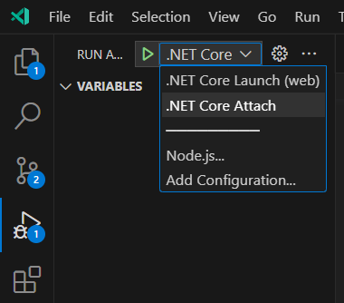

## Getting Started

### Prerequisites
- [Visual Studio](https://visualstudio.microsoft.com/vs/) or [Visual Studio Code](https://code.visualstudio.com/)
- [Git](https://git-scm.com/downloads)
- [.NET 7](https://dotnet.microsoft.com/download/dotnet/7.0)
- [Azure Data Studio](https://docs.microsoft.com/en-us/sql/azure-data-studio/download-azure-data-studio)
- [Migration tool](https://docs.microsoft.com/en-us/ef/core/cli/dotnet)

### Create the local environment

So, you wanna run locally the solution with a local databse, to do so you will now create a database in 5 minutes and make your solution use it.

[Download Azure data studio](https://docs.microsoft.com/en-us/sql/azure-data-studio/download-azure-data-studio), and connect to `Server=.;Database=MyDatabase;Trusted_Connection=True;` or 
_`Server=(LocalDB)\MSSQLLocalDB; Integrated Security=True; MultipleActiveResultSets=True`_
Welcome to your local sql server   
First let's bomb security locally so we can allow the sql user from the app access the database, run this query
```sql
USE [master]
GO
EXEC xp_instance_regwrite N'HKEY_LOCAL_MACHINE', 
N'Software\Microsoft\MSSQLServer\MSSQLServer', N'LoginMode', REG_DWORD, 2
GO
```
Create a new database `Create datatabase aiplugin-localdev`

Than let's create a user 
```sql
-- Create a login named testUser with password test
CREATE LOGIN testUser WITH PASSWORD = 'test';
GO

-- Create a user named testUserfor the login testUser
CREATE USER testUser FOR LOGIN testUser;
GO

-- Grant the user permission to access the database
ALTER ROLE db_datareader ADD MEMBER testUser;
ALTER ROLE db_datawriter ADD MEMBER testUser;
ALTER ROLE db_owner ADD MEMBER testUser;

GO
```

Good, you should be able to connect to it with this connection string    
`Server=.;Initial Catalog=aiplugin-localdev;Persist Security Info=False;User ID=testUser;Password=test;MultipleActiveResultSets=False;Encrypt=True;TrustServerCertificate=true;Connection Timeout=30;`   
On the solution under Api you should have `appsettings.json`, cool, that's like the defaults, we want to create an environment that will allow you with the selection of a combobox to switch between a database and another.   
Create `appsettings.Development.json` copy the content of appsettings.json in the new file and add in the json object this:
```json
"ConnectionStrings": {
    "DefaultConnection": "Server=.;Initial Catalog=aiplugin-localdev;Persist Security Info=False;User ID=testUser;Password=test;MultipleActiveResultSets=False;Encrypt=True;TrustServerCertificate=true;Connection Timeout=30;"
}
```

Cool, now 
if you're on visual studio on the ribbon there is a green triangle ▶️, on the right of it there is a dropbox, select `debug properties` (if you dont find it just search it on the search bar)
 

Now change the `ASPNETCORE_ENVIRONMENT` to `Development`  and as you're already there change the name of the Launch profile to development so you dont't confuse it later


---
If you use visual studio code, just select the correct launch configuration 

Now, cool everthing should work, but the databse is empty, so let's create it running:
`dotnet ef database update --project .\Infrastructure\Infrastructure.csproj --startup-project .\Api\Api.csproj -- --env Development`   
[check dotnet cli](https://learn.microsoft.com/en-us/ef/core/cli/dotnet) if you miss the tool to run the migration   
This will populate the database with all the tables you need to work. you can check it with azure data studio, the db should have table.

Nice job, time for a coffee ☕.